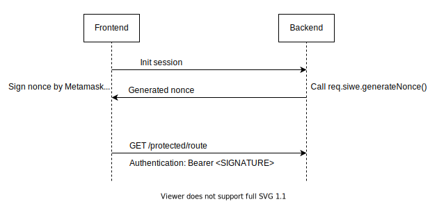

# fastify-siwe

[Sign In with Ethereum](https://login.xyz) middleware for [Fastify](https://fastify.io).

## How it works



1. The frontend request a nonce from the backend server. The nonce must be generated and verified on the backend to protect against replay attacks.
2. The dapp signs the message with user's wallet and saves the signed message locally.
3. An `Authentication` header is included in every request with the signed message.

### Header format

```
Authorization: Bearer <json encoded message>
```

Example of the signed message:

```json
{
  "signature":"0xafa5d63362c63b0da57f152afb0fbd296abd1aec046355927f2c34e26ab67b1a58ce34bcd609d312293391005c25780a87c110cfb6374a747184a35b047b08d91c",
  "message":{
    "domain":"localhost:3002",
    "address":"0x2C6e1d8a2E457c5D79fAD2c9F2f0f463e0Df5376",
    "statement":"Sign in with Ethereum to the app.",
    "uri":"http://localhost:3002",
    "version":"1",
    "chainId":1,
    "nonce":"JGiZrkbZ2uwUXl5yl",
    "issuedAt":"2022-04-23T17:25:20.427Z"
  }
}
```

## Installation

```
npm add fastify-siwe

yarn add fastify-siwe

pnpm add fastify-siwe
```

## Usage

Register the middleware:

```typescript
import { signInWithEthereum } from 'fastify-siwe'

fastify.register(signInWithEthereum())
```

All requests come decorated with `req.siwe` object.
`req.siwe.session` will contain be present if the request is authenticated.

```typescript
fastify.get(
  '/siwe/me',
  {},
  async function handler(
    this: FastifyInstance,
    req: FastifyRequest,
    reply,
  ) {
    if (!req.siwe.session) {
      reply.status(401).send()
      return
    }

    console.log('address =', req.siwe.session.address)
  },
)
```

Generating a new nonce:

```typescript
const nonce = await req.siwe.generateNonce()
```

> Checkout the full example at `packages/example`

### Implementing a custom store

By default sessions are stored in memory. Session data will be lost on server restart.

To preserve sessions you can implement a custom store backed by a database.

```typescript
import { SessionStore, signInWithEthereum } from 'fastify-siwe'

class MyStore implements SessionStore {
  async get(nonce: string): Promise<StoredSession | undefined> {
    // Fetch from database
  }

  public async save(session: StoredSession){
    // Save to database
  }


  async remove(nonce: string): Promise<void> {
    // Delete from database
  }
}

fastify.register(signInWithEthereum({ store: new MyStore() }))
```